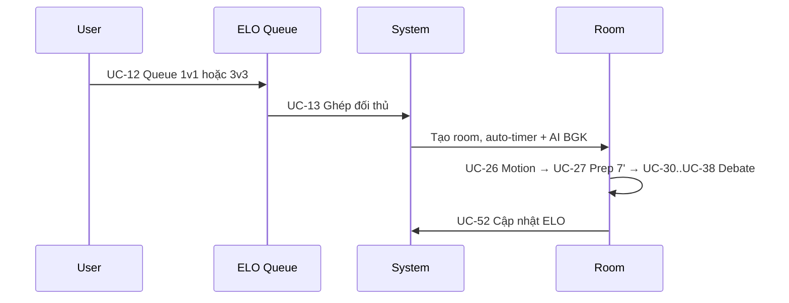

# 05 — Use Cases (Rút gọn MVP)

**Phiên bản:** v1.1 | **Ngày:** 18/05/2026  
**Loại tài liệu:** Đặc tả use case — phạm vi MVP đã rút gọn  
**Nguồn chuẩn:** [01_Debate_Rule.md](./01_Debate_Rule.md) · [02_Matchmaking_Room_System.md](./02_Matchmaking_Room_System.md) · [03_Role_System.md](./03_Role_System.md)  
**Kỹ thuật:** [04_TRD](./04_TRD_Technical_Requirements.md) · [07_AI](./07_AI_Integration_Guide.md) · [08_Socket](./08_Socket_Realtime_Guide.md)

---

## 1. Quy ước

| Thuật ngữ | Ý nghĩa |
|-----------|---------|
| **Actor** | Guest · User · **Debator** · **Host** · **Judge (BGK)** · **Viewer** · **Room Owner** · System · Admin |
| **Ưu tiên** | **MVP** (bắt buộc 6 tuần) · **P2** (phase 2 — sau MVP) |
| **Format** | Proposition (Ủng hộ) / Opposition (Phản đối) · Speaker S1–S3 · 1v1 / 3v3 |
| **Phase trận** | `motion` → `prep_7` → `speech` → `cross_exam` → `judge_feedback` → `prep_1` → … → `closing` → `final_judging` → `completed` |

---

## 2. Tổng quan phạm vi

| Miền | UC | Số lượng |
|------|-----|----------|
| A. Xác thực | 01–06 | 6 |
| B. Hồ sơ & Stats | 07–11 | 5 |
| C. Matchmaking & Phòng | 12–25 | 14 |
| D. Debate Engine | 26–43 | 18 |
| E. Host điều phối | 44–47 | 4 |
| F. Chấm điểm & Kết quả | 48–52 | 5 |
| G. Realtime | 53–57 | 5 |
| H. AI | 58–63 | 6 |
| I. Showcase | 64–66 | 3 |

**Tổng MVP: 66 use case** (giảm từ 110)

---

## 3. Danh mục use case

### A. Xác thực (01–06)

| UC | Tên | Actor | Ghi chú |
|----|-----|-------|---------|
| UC-01 | Đăng ký tài khoản | Guest | |
| UC-02 | Đăng nhập | Guest / User | |
| UC-03 | Đăng xuất | User | |
| UC-04 | Làm mới access token | User | |
| UC-05 | Lấy thông tin phiên (me) | User | |
| UC-06 | JWT & phân quyền API (RBAC) | System | |

> **Đã loại khỏi MVP:** Quên mật khẩu, đặt lại mật khẩu, đổi mật khẩu → Phase 2.

---

### B. Hồ sơ & Stats (07–11)

| UC | Tên | Actor | Ghi chú |
|----|-----|-------|---------|
| UC-07 | Xem hồ sơ công khai | Guest / User | |
| UC-08 | Cập nhật hồ sơ (displayName, bio, school) | User | |
| UC-09 | Tải / cập nhật avatar | User | URL input |
| UC-10 | Xem thống kê trận (W/L, điểm TB) | Guest / User | |
| UC-11 | Xem lịch sử tranh biện | User | |

> **Đã loại khỏi MVP:** Portfolio biểu đồ kỹ năng, AI Badges, tìm kiếm user nâng cao → Phase 2.

---

### C. Matchmaking & Phòng (12–25)

| UC | Tên | Actor | Ghi chú |
|----|-----|-------|---------|
| UC-12 | **Xếp hàng Rank** (queue 1v1 / 3v3, ELO) | User | |
| UC-13 | **Ghép trận Rank** — tạo room + auto-timer + AI BGK | System | |
| UC-14 | **Tạo Custom Room** (Owner, cấu hình format/host/judge) | User | |
| UC-15 | Chỉnh sửa cấu hình phòng (lobby) | Owner | |
| UC-16 | Hủy / xóa phòng (lobby) | Owner | |
| UC-17 | **Join Custom Room** — vào waiting | User | |
| UC-18 | **Select Position** (Pro/Opp, S1–S3, Judge, Host) | User | |
| UC-19 | **Lock position** (Owner) | Owner | |
| UC-20 | Gán slot **Host / Judge** (human) | Owner | |
| UC-21 | Lobby `waiting` → `ready` | Host / Owner / System | |
| UC-22 | **Start trận** (Owner hoặc Host) | Owner / Host | |
| UC-23 | Rời phòng | Participant | |
| UC-24 | Kick / ban (lobby) | Owner | |
| UC-25 | **Duyệt Live Matches** (filter 1v1/3v3, rank/custom) | Guest / User | |

> **Đã loại khỏi MVP:** Chuyển Room Ownership, Xem trận có password riêng (viewer join trực tiếp từ Live Matches) → đơn giản hóa.

---

### D. Debate Engine — theo [01_Debate_Rule](01_Debate_Rule.md) (26–43)

| UC | Tên | Actor | Ghi chú |
|----|-----|-------|---------|
| UC-26 | **Motion Announcement** | Host / System | |
| UC-27 | **Preparation 7 phút** — Main + Private Room | Debator / Host | |
| UC-28 | Vào / rời **Private Room** đội mình | Debator | |
| UC-29 | Kết thúc prep → mời về Main, bắt đầu trận | Host / System | |
| UC-30 | **Speech** — Host cho tín hiệu bắt đầu, timer 4' | Host / Debator | |
| UC-31 | **Luật lượt** Pro S1→Opp S1→…→Opp S3 | System | |
| UC-32 | **Cross Examination** — Pass Turn / Finish | Debator | |
| UC-33 | CE — phạt thiếu câu hỏi/trả lời (§10.3) | System | |
| UC-34 | **BGK nhận xét** sau mỗi speaker (3–5') | Judge (BGK) | |
| UC-35 | **Prep 1 phút** giữa các lượt | Debator / System | |
| UC-36 | **Closing** — Speaker 3, không CE, không luận điểm mới | Debator / System | |
| UC-37 | **Final Judging** — BGK chốt kết quả | Judge (BGK) | |
| UC-38 | Công bố đội thắng / hòa | Host / BGK | |
| UC-39 | Lưu phiên `completed` + transcript | System | |
| UC-40 | 1v1 — một debater giữ S1+S2+S3 | Debator | |
| UC-41 | Chạy đủ **luồng 25 bước** (orchestration) | System | |
| UC-42 | **Xem trận** (Viewer spectate) | Viewer | |
| UC-43 | Ghi nhận **luận điểm mới** S3 — cảnh báo | System / Host | Cảnh báo log |

---

### E. Host điều phối (44–47)

| UC | Tên | Actor | Ghi chú |
|----|-----|-------|---------|
| UC-44 | Tạm dừng / tiếp tục trận | Host | |
| UC-45 | Phát **thẻ vàng** | Host | |
| UC-46 | Kick / mute participant | Host | |
| UC-47 | Kick / cấm chat | Host | |

> **Đã loại khỏi MVP:** Thẻ đỏ (vàng đủ), override timer thủ công, bật/tắt chat viewer, chuyển quyền host → Phase 2.

---

### F. Chấm điểm & Kết quả (48–52)

| UC | Tên | Actor | Ghi chú |
|----|-----|-------|---------|
| UC-48 | Judge (human) nộp điểm theo §13 | Judge | |
| UC-49 | AI BGK chấm sau mỗi lượt | System (AI) | |
| UC-50 | Tổng hợp điểm nhiều judge + AI | System | |
| UC-51 | Xác định winner (Pro / Opp / draw) | System / BGK | |
| UC-52 | **Cập nhật ELO** sau trận Rank | System | |

---

### G. Realtime (53–57)

| UC | Tên | Actor | Ghi chú |
|----|-----|-------|---------|
| UC-53 | Kết nối socket + join room | User | |
| UC-54 | Đồng bộ phase & timer (server-authoritative) | System | |
| UC-55 | Chat phòng (Main; types: chat/system) | Participant | |
| UC-56 | **Reconnect** — khôi phục phase/timer/CE | User / System | |
| UC-57 | Broadcast card / kick notification | System | |

> **Đã loại khỏi MVP:** Typing indicator, Online presence → Phase 2.

---

### H. AI (58–63)

| UC | Tên | Actor | Ghi chú |
|----|-----|-------|---------|
| UC-58 | **AI BGK** — nhận xét & chấm per-turn | System (AI) | Core |
| UC-59 | AI phân tích speech (claims, weaknesses, fallacies) | System (AI) | Gộp fallacy |
| UC-60 | AI tóm tắt trận | System (AI) | |
| UC-61 | AI phán quyết cuối (so sánh 2 đội) | System (AI) | |
| UC-62 | AI kiểm tra toxic (chat) | System (AI) | Auto-moderate |
| UC-63 | Fallback khi OpenAI unavailable | System | Graceful |

> **Đã loại khỏi MVP:**
> - ~~AI Host~~ → Thay bằng auto-timer system
> - ~~AI gợi ý phản biện~~ → Phase 2
> - ~~AI coaching sau trận~~ → Phase 2
> - ~~AI validate CE question~~ → Phase 2
> - ~~Phát hiện spam chat riêng~~ → Gộp vào toxic check

---

### I. Showcase (64–66)

| UC | Tên | Actor | Ghi chú |
|----|-----|-------|---------|
| UC-64 | **Leaderboard Global** (ELO) | User | |
| UC-65 | **Live Matches** list + filter | Guest / User | |
| UC-66 | Xem replay trận (transcript + timeline) | User | |

> **Đã loại khỏi MVP:** Leaderboard weekly/monthly/yearly, Debate Thread comments, Tournament bracket, Community feed → Phase 2.

---

## 4. Luồng tổng hợp

### 4.1 Rank Matchmaking

### 4.2 Custom Room

| Bước | UC | Actor chính |
|------|-----|-------------|
| Tạo phòng, cấu hình 1v1/3v3, Host/Judge AI hoặc Human | UC-14 | Owner |
| Hiển thị trên Live Matches | UC-65 | |
| User join, Select Position | UC-17, UC-18 | |
| Owner lock position, đủ slot → ready | UC-19, UC-21 | |
| Owner hoặc Host Start | UC-22 | |
| Motion → Prep 7' → Debate → completed | UC-26–UC-39 | |
| Replay | UC-66 | |

---

## 5. Ma trận Actor × quyền (tóm tắt)

| Hành động | Debator | Host | Judge | Viewer | Owner (lobby) |
|-----------|---------|------|-------|--------|---------------|
| Speech / CE | ✓ lượt | — | — | — | — |
| Điều phối phase | — | ✓ | — | — | — |
| Chấm điểm BGK | — | — | ✓ | — | — |
| Xem Main Room | ✓ | ✓ | ✓ | ✓ | ✓ |
| Private Room đội | ✓ prep | — | — | — | — |
| Kick / ban | — | ✓ | — | — | ✓ |
| Start trận | — | ✓ | — | — | ✓ |
| Cấu hình phòng | — | — | — | — | ✓ |

---

## 6. Gợi ý ánh xạ sprint (6 tuần)

| Tuần | UC ưu tiên |
|------|------------|
| 1 | UC-01–06, UC-14, UC-17–18, Socket setup |
| 2 | UC-12–13, UC-19–25, UC-53–55 |
| 3 | UC-26–36, UC-32–34, UC-44–47, UC-54 |
| 4 | UC-37–43, UC-48–52, UC-58–63 |
| 5 | UC-56, UC-62, UC-64–66, polish |
| 6 | Deploy, demo, bug fixes |

---

## 7. Phase 2 — Sau MVP (từ doc 10)

Các feature đã loại khỏi MVP, triển khai khi có thời gian:

| Nhóm | Mô tả |
|------|--------|
| AI Host | AI điều phối phase thay human |
| AI gợi ý phản biện + coaching | Hỗ trợ debater |
| Knowledge Bank | Evidence, Motion forum, Argument tree |
| Portfolio + AI Badges | Biểu đồ kỹ năng, huy hiệu tự động |
| Credibility System | Điểm uy tín, vote có trọng số |
| Tournament bracket | Auto room, bracket, scheduling |
| Community feed | Posts, vote, comment |
| Challenge / Duel | Thách đấu trực tiếp |
| Daily Challenge | Bài tập hàng ngày |
| Leaderboard mùa | Weekly/Monthly/Yearly + badge |

Chi tiết: [10_Idea_Build_Community.md](./10_Idea_Build_Community.md)

---

*Mọi UC debate phải khớp [01_Debate_Rule.md](./01_Debate_Rule.md); phòng/ghép trận khớp [02](./02_Matchmaking_Room_System.md) và [03](./03_Role_System.md).*
