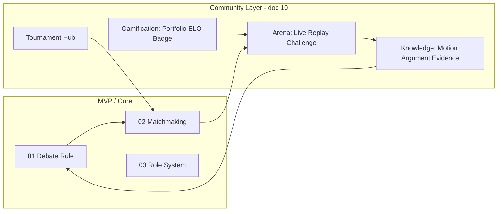

# 10 — Idea: Build Community (Hệ sinh thái cộng đồng)

**Phiên bản:** v1.0 | **Ngày:** 14/05/2026  
**Loại tài liệu:** Ý tưởng sản phẩm / roadmap mở rộng (không thay thế MVP)  
**Tham chiếu:** [01_Debate_Rule.md](./01_Debate_Rule.md) · [02_Matchmaking_Room_System.md](./02_Matchmaking_Room_System.md) · [00_Presentation.md](./00_Presentation.md)

> Tài liệu mô tả **hướng xây cộng đồng** quanh nền tảng tranh biện: tri thức có cấu trúc, khán giả tương tác, game hóa, giải đấu. Các mục đánh dấu *(sau MVP)* là giai đoạn triển khai sau lõi match + room.

---

## Mục lục

1. [Phân hệ Tri thức & Học thuật](#i-phân-hệ-tri-thức--học-thuật-knowledge--academy)
2. [Phân hệ Khán giả & Tương tác](#ii-phân-hệ-khán-giả--tương-tác-spectator--arena)
3. [Phân hệ Game hóa & Cá nhân hóa](#iii-phân-hệ-game-hóa--cá-nhân-hóa-gamification--portfolio)
4. [Phân hệ Giải đấu](#iv-phân-hệ-tổ-chức-giải-đấu-tournament-system)
5. [Liên kết với sản phẩm hiện tại](#v-liên-kết-với-sản-phẩm-hiện-tại)

---

## I. Phân hệ Tri thức & Học thuật (Knowledge & Academy)

**Mục tiêu:** Nền tảng như **hệ thống tri thức có cấu trúc** — mọi nội dung tranh biện được tích lũy, kiểm chứng và tái sử dụng.

### 1.1 Evidence Bank (Ngân hàng dẫn chứng)

| Khía cạnh | Nội dung |
|-----------|----------|
| **Chức năng** | Đăng dẫn chứng phục vụ tranh biện: số liệu, nghiên cứu, báo cáo, trích dẫn nguồn uy tín |
| **Claim** | Mô tả ngắn (1 câu) |
| **Source** | URL hoặc tài liệu nguồn |
| **Type** | `research` · `statistic` · `news` · `report` |
| **Topic** | Chủ đề / motion liên quan |

**Nguyên tắc**

- Mỗi Evidence **gắn ít nhất một** Motion hoặc Argument — không tồn tại độc lập vô ngữ cảnh.
- Cộng đồng: Agree / Disagree; trọng số vote theo **Credibility** người dùng.
- Đánh giá độ uy tín nguồn (source reliability).
- Bảng **Top Contributors** theo *chất lượng* Evidence, không chỉ số lượng.

### 1.2 Motion System (Diễn đàn chủ đề)

| Loại | Mô tả |
|------|--------|
| **Official Motion** | Hệ thống / admin — dùng cho match chính thức |
| **Community Motion** | User đề xuất — cần ngưỡng vote để hiển thị rộng |

**Cấu trúc Motion**

- Nội dung chủ đề
- Hai phía: **Pro (Ủng hộ)** · **Con (Phản đối)**
- Danh sách Argument theo phía
- Evidence liên quan

**Giao diện:** hai cột đối kháng (Pro vs Con); user chọn phía và đóng góp luận điểm.

**Kiểm duyệt:** motion mới qua đánh giá hoặc ngưỡng tương tác — chống spam.

### 1.3 Argument System (Hệ thống luận điểm)

| Khía cạnh | Nội dung |
|-----------|----------|
| **Vai trò** | Đơn vị nội dung cốt lõi — xây dựng và trao đổi lập luận |
| **Cấu trúc** | Nội dung · Stance (Pro/Con) · liên kết Motion · nhiều Evidence |
| **Quan hệ** | Argument phản biện Argument (cây tranh luận); dùng trong match hoặc replay |
| **Tương tác** | Vote Agree/Disagree; comment có stance rõ, mang tính phản biện |

---

## II. Phân hệ Khán giả & Tương tác (Spectator & Arena)

**Mục tiêu:** Người xem là **một phần hệ sinh thái** — không chỉ quan sát mà còn đánh giá và phản biện.

### 2.1 Live Match

- Hiển thị trận **đang diễn ra** (realtime).
- Vai trò **Viewer** — xem [03_Role_System.md](./03_Role_System.md).
- Reaction realtime; theo dõi speaker, timer, phase.

*Liên kết:* [02_Matchmaking_Room_System.md](./02_Matchmaking_Room_System.md) — Community Live Matches.

### 2.2 Debate Replay & Thread

Sau mỗi trận, hệ thống tạo **Debate Thread**:

| Thành phần | Mô tả |
|------------|--------|
| Motion | Chủ đề trận |
| Kết quả BGK | Verdict + điểm |
| Timeline | Các lượt phát biểu |
| Transcript | Đầy đủ (nếu có) |

**Tương tác sau trận**

- Bình luận theo stance
- Phản biện từng speaker / đoạn cụ thể
- Vote lại kết quả (Agree/Disagree với BGK) — *không thay thế chấm chính thức*

**Mục tiêu:** kéo dài vòng đời nội dung; thảo luận sau trận có chất lượng.

### 2.3 Challenge System (Debate Duel)

| Bước | Mô tả |
|------|--------|
| 1 | Cá nhân / đội gửi **lời thách đấu** tới đối tượng cụ thể |
| 2 | Đối phương **chấp nhận** → trận công khai |
| 3 | Hệ thống kiểm tra **rating** (cân bằng trình) |
| 4 | Hiển thị trên feed; viewer **đặt lịch** theo dõi |

---

## III. Phân hệ Game hóa & Cá nhân hóa (Gamification & Portfolio)

**Mục tiêu:** Giá trị lâu dài qua **hồ sơ năng lực** và ghi nhận thành tích.

### 3.1 Digital Debate Portfolio

Trang hồ sơ cá nhân:

- Lịch sử trận · kết quả · thống kê
- Hiệu suất theo vai trò (Speaker 1 / 2 / 3)
- Biểu đồ kỹ năng: Logic · Rebuttal · Cross-examination · Evidence · Delivery  
  *(dữ liệu từ BGK + AI — khớp [01_Debate_Rule.md §13](./01_Debate_Rule.md))*

### 3.2 AI Certified Badges

Huy hiệu **tự động**, dựa trên dữ liệu khách quan (không phụ thuộc vote):

| Ví dụ badge | Điều kiện gợi ý |
|-------------|-----------------|
| Logic Master | Điểm logic cao ổn định nhiều trận |
| Fallacy Resistant | Tỷ lệ ngụy biện thấp |
| Rebuttal Specialist | Phản biện hiệu quả cao |

### 3.3 Credibility System

Đánh giá độ tin cậy user:

- Chất lượng Argument
- Độ chính xác Evidence
- Vote có phù hợp đánh giá chung

**Ứng dụng:** tăng trọng số vote; giảm spam / tài khoản mới lạm dụng.

### 3.4 Ranking System (ELO Leaderboard)

| Bảng | Cơ chế |
|------|--------|
| **Global** | ELO tổng, không reset |
| **Weekly / Monthly / Yearly** | Reset theo chu kỳ; điểm từ ELO gain hoặc performance score trong kỳ |

Vinh danh top kỳ → badge / danh hiệu mùa.

*Liên kết:* Rank mode trong [02_Matchmaking_Room_System.md](./02_Matchmaking_Room_System.md).

### 3.5 Daily Challenge (Survival Mode) *(sau MVP)*

- Bài tập tranh biện **hàng ngày** do AI tạo
- User phản biện / chỉ lỗi logic trong thời gian giới hạn
- **Streak** ngày liên tiếp + leaderboard streak

---

## IV. Phân hệ Tổ chức giải đấu (Tournament System)

**Mục tiêu:** Thi đấu quy mô lớn, chuyên nghiệp, gắn chặt match + replay + portfolio.

### 4.1 Tournament Hub

Trung tâm giải **đang / sắp diễn ra**:

| Loại | Mô tả |
|------|--------|
| **Official** | Hệ thống hoặc đối tác |
| **Community** | User / tổ chức tạo |

**Thông tin hiển thị:** tên · format (1v1 / 3v3) · thời gian · số đội · trạng thái (đăng ký / active / ended).

### 4.2 Đăng ký & quản lý đội

- Đăng ký cá nhân hoặc team; tạo team + mời thành viên
- Kiểm tra: rating · số thành viên · role phù hợp

### 4.3 Bracket & Scheduling

- Bracket: single / double elimination · round robin
- Xếp lịch; **auto tạo debate room** mỗi trận
- Đến giờ: room chuẩn [01_Debate_Rule](./01_Debate_Rule.md); gán Debater / Judge / Host

### 4.4 Tích hợp Match & Replay

Mỗi trận tournament:

1. Match như bình thường  
2. Sinh **replay** + **debate thread**  
3. Kết quả cập nhật **bracket** realtime  

### 4.5 Bảng xếp hạng & thành tích giải

- Xếp hạng theo vòng; Win/Loss; performance từng vòng
- Ghi nhận vào **Portfolio**
- Danh hiệu / huy hiệu tournament trên hồ sơ

---

## V. Liên kết với sản phẩm hiện tại

| Thành phần doc 10 | Phụ thuộc lõi |
|------------------|---------------|
| Evidence / Argument / Motion | Motion từ trận thật; format Pro/Con |
| Live Match | 02 — Live Matches |
| Replay Thread | Session + transcript sau `completed` |
| ELO / Portfolio | Kết quả match rank + BGK scores |
| Tournament | 02 Custom Room + auto room |

---

## Tài liệu liên quan

| File | Nội dung |
|------|----------|
| [README.md](./README.md) | Mục lục toàn bộ docs |
| [05_Use_Cases.md](./05_Use_Cases.md) | UC-16–18, 83–110 (portfolio, knowledge, arena, tournament) |
| [06_Development_Plan_6Weeks.md](./06_Development_Plan_6Weeks.md) | Dev 5 — Tournament & Community (MVP) |

---

*Ý tưởng trong file này là **định hướng sản phẩm**; ưu tiên triển khai theo [06_Development_Plan](./06_Development_Plan_6Weeks.md) trước khi mở rộng toàn bộ phân hệ.*
