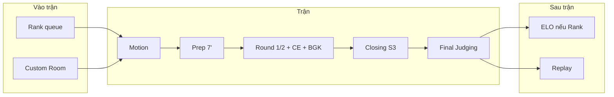

# AI Debate Platform — Overview

**Phiên bản:** v1.1 (Rút gọn) | **Ngày:** 18/05/2026  
**Loại tài liệu:** Tổng quan dự án — điểm vào cho mọi vai trò  
**Bộ tài liệu:** v1.1 (18/05/2026) · Mục lục: [README.md](./README.md)

---

## 1. Dự án là gì?

**AI Debate Platform** là nền tảng tranh biện trực tuyến theo thời gian thực: hai đội tranh luận có cấu trúc (motion, chuẩn bị, lượt nói, chất vấn, chấm điểm), có **Host** điều phối và **BGK** đánh giá — được hỗ trợ bởi **AI BGK** khi thiếu người hoặc ở chế độ xếp hạng.

Hình ảnh sản phẩm: **"chơi cờ online" cho debate** — ghép trận hoặc tạo phòng → lobby → trận theo phase cố định → kết quả & xếp hạng.

---

## 2. Mô hình sản phẩm (tóm tắt)

### 2.1 Luật tranh biện — nguồn chuẩn duy nhất

Mọi tài liệu và code phải khớp **[01_Debate_Rule.md](./01_Debate_Rule.md)**:

| Thành phần | Quy định chính |
|------------|----------------|
| Đội | **Proposition (Ủng hộ)** vs **Opposition (Phản đối)** |
| Chế độ | **1v1** (một người giữ S1–S3) · **3v3** |
| Prep | **7 phút** (Main + Private Room / đội) |
| Speech | **4 phút** / speaker (bắt đầu khi Host cho phép) |
| Chất vấn | **Cross Examination** sau S1 & S2 — Pass Turn / Finish, 3'/đội, tối đa 2 câu/đội |
| Closing | S3 — **không** CE, **không** luận điểm mới |
| Chấm | BGK 3–5' sau mỗi lượt; 6 tiêu chí / 100 điểm (§13) |

> Không dùng mô hình AP/POI cũ.

### 2.2 Hai cách vào trận

| Kênh | Mô tả | Tài liệu |
|------|--------|----------|
| **Rank** | Queue ELO 1v1/3v3 → ghép tự động → **Auto-timer + AI BGK** | [02 §3](./02_Matchmaking_Room_System.md) |
| **Custom Room** | User tạo phòng, cấu hình Host/Judge Human/AI, password, lobby | [02 §4–5](./02_Matchmaking_Room_System.md) |

### 2.3 Vai trò trong phòng

| Vai trò | Mô tả |
|---------|--------|
| **Debator** | Tranh luận cho Pro hoặc Opp |
| **Host** | Phase, timer, CE, kỷ luật |
| **Judge (BGK)** | Nhận xét & chấm |
| **Viewer** | Xem Main Room |
| **Room Owner** | Meta: tạo/cấu hình lobby (≠ Host khi trận chạy) |

Chi tiết quyền: **[03_Role_System.md](./03_Role_System.md)**.

### 2.4 Luồng trận (rút gọn)



---

## 3. Ba lớp hệ thống

| Lớp | Chức năng | Doc chính |
|-----|-----------|-----------|
| **Matchmaking** | ELO queue, auto room, AI BGK mặc định | [02](./02_Matchmaking_Room_System.md) |
| **Room & Debate Engine** | Custom, lobby, 25 bước, timer, CE | [01](./01_Debate_Rule.md), [05](./05_Use_Cases.md) |
| **Showcase** | Live Matches, Leaderboard, Replay | [05](./05_Use_Cases.md) |

**Kỹ thuật:** MERN + Socket.IO (server-authoritative) + OpenAI — [04_TRD](./04_TRD_Technical_Requirements.md).

---

## 4. AI trong sản phẩm (rút gọn MVP)

| Vai trò AI | Khi nào | Ghi chú |
|------------|---------|---------|
| **AI BGK** | Nhận xét sau lượt + verdict cuối | Core AI feature |
| AI phân tích speech | Hỗ trợ debater xem lại | Gộp fallacy vào phân tích |
| AI kiểm tra toxic chat | Moderation | Tự động |
| AI tóm tắt trận | Sau trận | Cho viewer/debater |
| Fallback khi OpenAI down | Luôn | Graceful degradation |

**Đã loại khỏi MVP:**
- ~~AI Host~~ → Thay bằng auto-timer + system tự chuyển phase
- ~~AI gợi ý phản biện~~ → Phase 2
- ~~AI coaching sau trận~~ → Phase 2
- ~~AI validate CE question~~ → Phase 2 (human host đủ)

---

## 5. Phạm vi MVP (6 tuần) — ĐÃ RÚT GỌN

### MVP — bắt buộc có (~60 UC)

- Auth cơ bản (register, login, logout, refresh, me, RBAC)
- Profile + stats cơ bản (view, edit, W/L, lịch sử)
- Custom Room + Rank queue
- Debate engine: motion → prep 7' → speech → CE → BGK → kết quả
- Realtime timer & socket (chat, reconnect)
- AI BGK (chấm + verdict + tóm tắt + toxic)
- Host controls tối thiểu (pause/resume, thẻ vàng, kick)
- ELO + Leaderboard Global
- Live Matches list + spectate

### Đã loại khỏi MVP (defer Phase 2)

| Feature | Lý do loại |
|---------|------------|
| AI Host (orchestrate phase bằng AI) | Phức tạp, auto-timer đủ dùng |
| Knowledge Bank (Evidence, Motion forum, Argument tree) | Cộng đồng dài hạn |
| Challenge / Duel | Rank queue đã đủ |
| Daily Challenge | Gamification phụ |
| Credibility System | Cần data lớn |
| Portfolio + AI Badges | Nice-to-have |
| Tournament bracket đầy đủ | Quá phức tạp |
| Community feed (posts, vote, comment) | Không core |
| Debate Thread comments + vote lại BGK | Cộng đồng |
| Typing indicator + Online presence | Nice-to-have |
| Leaderboard Weekly/Monthly/Yearly | Global đủ |
| Quên/đặt lại mật khẩu | Không critical cho demo |
| Thẻ đỏ, override timer, bật/tắt chat viewer, chuyển quyền host | Thẻ vàng + kick đủ |

### Phase 2 (sau MVP)

Toàn bộ nội dung [10_Idea_Build_Community.md](./10_Idea_Build_Community.md) + các UC đã defer.

---

## 6. Bản đồ tài liệu

| Bạn là… | Đọc theo thứ tự |
|---------|------------------|
| **KH / đầu tư / đối tác** | [00_Presentation](./00_Presentation.md) → Overview (file này) → [01](./01_Debate_Rule.md) |
| **PM / BA** | [01](./01_Debate_Rule.md) → [02](./02_Matchmaking_Room_System.md) → [03](./03_Role_System.md) → [05](./05_Use_Cases.md) |
| **Dev / Architect** | [04_TRD](./04_TRD_Technical_Requirements.md) → [05](./05_Use_Cases.md) → [07](./07_AI_Integration_Guide.md) + [08](./08_Socket_Realtime_Guide.md) → [06](./06_Development_Plan_6Weeks.md) → [09](./09_Team_Task_Breakdown.md) |

| # | File | Vai trò |
|---|------|---------|
| — | **Overview.md** | Tổng quan (file này) |
| 00 | [00_Presentation.md](./00_Presentation.md) | Pitch phi kỹ thuật |
| 01 | [01_Debate_Rule.md](./01_Debate_Rule.md) | **Chuẩn luật** |
| 02 | [02_Matchmaking_Room_System.md](./02_Matchmaking_Room_System.md) | Ghép trận & phòng |
| 03 | [03_Role_System.md](./03_Role_System.md) | Phân quyền |
| 04 | [04_TRD_Technical_Requirements.md](./04_TRD_Technical_Requirements.md) | TRD, API, DB |
| 05 | [05_Use_Cases.md](./05_Use_Cases.md) | ~60 UC — danh mục |
| 06 | [06_Development_Plan_6Weeks.md](./06_Development_Plan_6Weeks.md) | Kế hoạch 6 tuần |
| 07 | [07_AI_Integration_Guide.md](./07_AI_Integration_Guide.md) | AI |
| 08 | [08_Socket_Realtime_Guide.md](./08_Socket_Realtime_Guide.md) | Realtime |
| 09 | [09_Team_Task_Breakdown.md](./09_Team_Task_Breakdown.md) | Task theo dev |
| 10 | [10_Idea_Build_Community.md](./10_Idea_Build_Community.md) | Roadmap Phase 2 |

---

## 7. Số liệu dự án (v1.1 — rút gọn)

| Hạng mục | Giá trị |
|----------|---------|
| Use case MVP | **~60** (giảm từ 110) |
| Timeline MVP | **6 tuần** · 5 developers |
| Format trận | 1v1 · 3v3 |
| Phase engine | 7+ phase types (motion → completed) |
| Luồng chuẩn | **25 bước** — [01 §15](./01_Debate_Rule.md) |

---

## 8. Tech stack

```
Frontend:  React · TypeScript · Vite · TailwindCSS · Zustand · Socket.IO Client
Backend:   Node.js · Express · TypeScript · Socket.IO · Mongoose
Database:  MongoDB Atlas
AI:        OpenAI GPT-4o
Deploy:    Vercel (FE) · Render (BE)
```

---

## 9. Team MVP (5 dev) — ĐÃ TÁI PHÂN CÔNG

| Dev | Trách nhiệm chính |
|-----|-------------------|
| Dev 1 | Auth · User · ELO · Leaderboard |
| Dev 2 | Matchmaking · Custom Room · Debate Engine |
| Dev 3 | Socket · Timer · Cross Examination · Chat |
| Dev 4 | AI BGK · Speech Analysis · Toxic Detection |
| Dev 5 | Live Matches · Replay · Hỗ trợ Dev 2/3 (Debate UI, testing) |

> Dev 5 không còn làm community feed / tournament bracket. Thay vào đó hỗ trợ Dev 2 và Dev 3 ở phần UI debate phức tạp.

---

## 10. Nguyên tắc khi đọc / chỉnh sửa docs

1. **01_Debate_Rule** là luật — không đưa AP/POI trở lại.
2. **Owner ≠ Host** — quyền lobby vs quyền điều phối trận tách bạch.
3. **Prep = 7 phút** — không 15 phút.
4. Thay đổi sản phẩm → cập nhật `01`/`02`/`03` trước, rồi `05`/`04`/`06`/`09`.
5. Ý tưởng dài hạn → `10`; chỉ triển khai sau MVP.
6. **Không thêm feature mới vào MVP** — scope đã lock.

---

*Tổng quan v1.1 (rút gọn) · Chi tiết kỹ thuật: [04_TRD](./04_TRD_Technical_Requirements.md) · Chi tiết chức năng: [05](./05_Use_Cases.md)*
